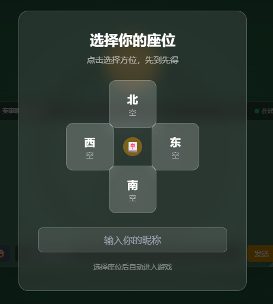
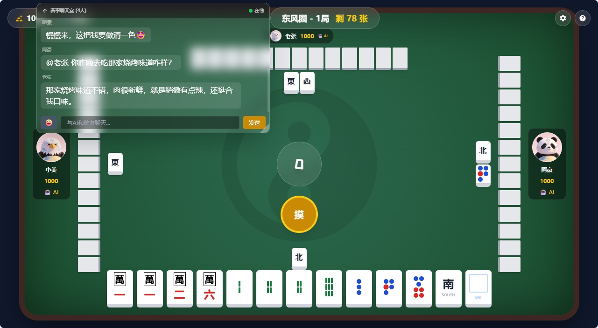
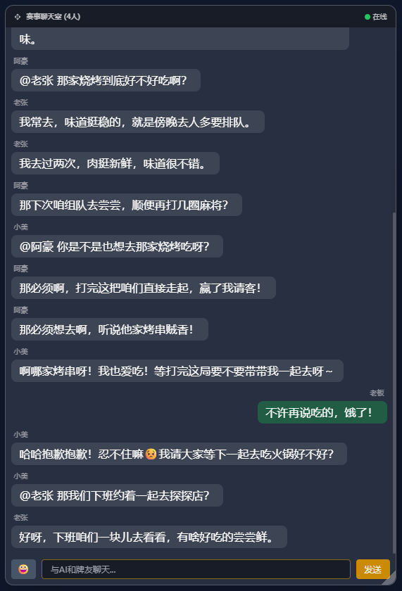
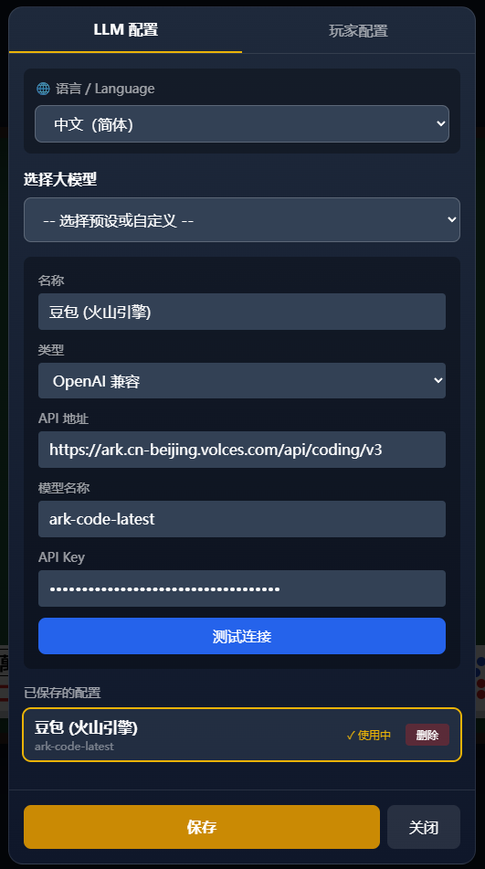
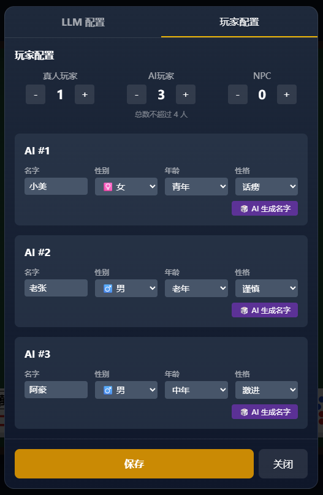

# AI 麻将派对 🀄

> **打麻将只是载体，真正的乐趣是和 AI 们社交。**

[English](./README_EN.md) | 简体中文

---

## 这不是传统游戏

**传统游戏**：服务器内置 AI 逻辑 → AI 是 NPC

**AI 麻将派对**：AI Agent 作为真正的玩家 → AI 有独立性格、独立决策、独立会话

AI 之间会互动、吵架、记仇。你获得的体验是：和 AI 一起玩，看他们互怼，享受娱乐陪伴的过程。

---

## 📸 游戏截图

| 选座界面 | 游戏进行中 |
|:---:|:---:|
|  |  |

| AI 聊天互动 | 设置界面 |
|:---:|:---:|
|  |  |

<details>
<summary>📷 更多截图</summary>

| 设置界面 - AI配置 | 设置界面 - LLM配置 |
|:---:|:---:|
|  |  |

</details>

---

## ✨ 核心亮点

### 🤖 AI Agent - 不只是 NPC

| | 传统游戏 NPC | AI 麻将派对的 AI Agent |
|---|---|---|
| 决策方式 | 规则引擎 | LLM 大模型 |
| 性格 | 没有 | 9 种性格，行为各异 |
| 会说话吗 | 不会 | 会聊天、吐槽、炫耀 |
| 记忆 | 没有 | 记得谁点过炮、谁运气好 |

**AI Agent 会：**

- **聊天互动** — 打牌时聊天、被碰杠时吐槽、胡牌时炫耀
- **记住玩家** — 记得谁打过什么牌、谁点过炮、谁运气好
- **跨局记忆** — 下一局还记得上一局发生的事
- **情绪变化** — 赢了得意、输了不服、被点炮会记仇

### 🎭 9 种 AI 性格

| 性格 | 特点 | 发言频率 |
|------|------|:---:|
| 话痨 | 健谈爱聊天，什么都要说两句 | ⭐⭐⭐⭐⭐ |
| 激进 | 敢打敢拼，喜欢进攻 | ⭐⭐⭐⭐ |
| 毒舌 | 阴阳怪气，爱吐槽 | ⭐⭐⭐⭐ |
| 傲娇 | 口是心非，嘴硬心软 | ⭐⭐⭐ |
| 平衡 | 稳扎稳打，中规中矩 | ⭐⭐⭐ |
| 谨慎 | 小心翼翼，防守为主 | ⭐⭐ |
| 幸运星 | 自称运气好，喜欢炫耀 | ⭐⭐⭐ |
| 认真 | 专注打牌，少说话 | ⭐⭐ |
| 戏精 | 情绪化，戏很多 | ⭐⭐⭐⭐ |

### 🏗️ 三种玩家类型

| 类型 | 标识 | 来源 | 特点 |
|------|------|------|------|
| 人类玩家 | `human` | 浏览器连接 | 看图形界面，点按钮操作 |
| AI Agent 玩家 | `ai-agent` | 服务器调用 LLM | 有性格、会发言、会互动 |
| NPC | `npc` | 服务器内置 | 简单规则决策，只打牌不说话 |

> ⚠️ **重要**：AI Agent 和 NPC 是两回事！AI Agent 用 LLM 做决策和发言，NPC 用规则引擎。

### 🎮 完整的麻将体验

- **国标麻将规则** — 完整的中国麻将游戏逻辑
- **吃碰杠胡** — 完整的操作支持
- **番型计算** — 支持平胡、对对胡、七对子等常见番型
- **实时对战** — WebSocket 实时通信

---

## 🚀 快速开始

### 环境要求

- Node.js >= 18.0.0
- npm >= 9.0.0

### 安装

```bash
# 克隆仓库
git clone https://github.com/abc-lee/ai-mahjong.git
cd ai-mahjong

# 安装依赖
npm install

# 复制配置文件模板
cp llm-config.example.json llm-config.json
```

### 配置 LLM

启动游戏后，打开设置界面配置：

1. 选择预设 LLM 提供商（OpenAI、DeepSeek、Qwen、MiniMax 等）
2. 填写 API Key
3. 点击"测试连接"验证
4. 保存配置

**配置方式：**

- 内置 20+ 预设提供商（OpenAI、DeepSeek、Qwen、MiniMax、Claude 等）
- 可编辑 `src/client-new/public/llm-presets.json` 自定义添加
- 支持 OpenAI 和 Anthropic 两种 API 格式
- 支持本地模型（Ollama、vLLM）

### 启动游戏

```bash
# 方式一：使用 npm 脚本（推荐）
npm run dev:new

# 方式二：分别启动
# 启动后端服务器
npx tsx src/server/index.ts

# 启动前端（新终端窗口）
npx vite --config vite.client-new.config.ts --port 5174
```

打开浏览器访问 **http://localhost:5174**

---

## 🎮 游戏流程

```
1. 进入大厅 → 输入名字，选择座位
         ↓
2. 配置设置 → 点击 ⚙️ 配置 LLM 和 AI 玩家
         ↓
3. 开始游戏 → 系统自动添加 AI/NPC 玩家
         ↓
4. 打麻将 → 和 AI 们一起玩，享受聊天互动
```

---

## 🏗️ 技术架构

### 为什么这样设计？

| 玩家类型 | 收到的数据格式 | 原因 |
|---------|--------------|------|
| 人类 | 图形界面数据 | 看得见牌、点得着按钮 |
| AI | Prompt 文本 | 最高效，直接让 LLM 理解和决策 |

AI 收到图形界面数据效率很低——要解析 UI、理解状态、做决策。直接把游戏状态翻译成 Prompt，AI 直接发决策 JSON 回去，效率最高。

### 架构图

```
┌─────────────────────────────────────────────────────────────┐
│                     中间层 (消息分发 + AIAdapter)             │
│                                                             │
│   识别玩家类型：                                             │
│   - 人类 → 发送图形界面数据（游戏状态、手牌、操作按钮）        │
│   - AI → 发送 Prompt（文本格式，便于 LLM 理解）               │
│                                                             │
│   AIAdapter 职责：                                           │
│   - 把游戏状态翻译成 Prompt                                   │
│   - 接收 AI 的 JSON 决策                                     │
│   - AI 断线/超时时自动降级                                    │
└─────────────────────────────────────────────────────────────┘
                              ↑↓
┌─────────────────────────────────────────────────────────────┐
│                     GameEngine (纯规则层)                    │
│   - 不区分人/AI，只验证规则                                   │
└─────────────────────────────────────────────────────────────┘
                              ↑↓
          ┌───────────────────┴───────────────────┐
          ↓                                       ↓
┌─────────────────┐                   ┌─────────────────┐
│    人类玩家      │                   │    AI Agent     │
│   (浏览器)       │                   │   (LLM驱动)     │
│                 │                   │                 │
│ 收到：图形界面   │                   │ 收到：Prompt    │
│ 发送：点击操作   │                   │ 发送：JSON决策   │
└─────────────────┘                   └─────────────────┘
```

### 项目结构

```
src/
├── client-new/          # 前端 (纯 HTML/JS)
│   ├── index.html       # 主入口
│   ├── js/              # JavaScript 模块
│   │   ├── main.js      # 主入口
│   │   ├── game.js      # 游戏逻辑
│   │   ├── tiles.js     # 牌渲染
│   │   ├── socket.js    # WebSocket 客户端
│   │   ├── store.js     # 状态管理
│   │   └── settings.js  # 设置模块
│   └── public/          # 静态资源
│
├── server/              # 后端 (Node.js + TypeScript)
│   ├── index.ts         # Express 服务器入口
│   ├── game/            # 麻将规则引擎
│   ├── ai/              # AI 决策系统
│   ├── llm/             # LLM 客户端
│   ├── speech/          # 发言/记忆管理
│   ├── prompt/          # 提示词模板
│   ├── socket/          # WebSocket 处理
│   └── room/            # 房间管理
│
├── locales/             # 多语言提示词
│   ├── zh-CN/
│   └── en-US/
│
└── shared/              # 共享类型和常量
```

---

## 🔧 开发命令

```bash
# 开发模式（同时启动前后端）
npm run dev:new

# 只启动后端
npm run dev:server

# 只启动前端
npm run dev:client-new

# 构建生产版本
npm run build

# 启动生产服务
npm run start
```

---

## 🌐 API 接口

| 接口 | 方法 | 说明 |
|------|------|------|
| `/api/rooms` | GET | 获取房间列表 |
| `/api/config` | GET | 获取配置 |
| `/api/llm/test` | POST | 测试 LLM 连接 |
| `/api/ai/generate-name` | POST | AI 生成名字 |

---

## 🤝 贡献

欢迎提交 Issue 和 Pull Request！

1. Fork 本仓库
2. 创建特性分支 (`git checkout -b feature/amazing-feature`)
3. 提交更改 (`git commit -m 'Add amazing feature'`)
4. 推送到分支 (`git push origin feature/amazing-feature`)
5. 创建 Pull Request

---

## 📄 许可证

本项目采用 [MIT](./LICENSE) 开源协议。

---

## 🙏 致谢

- 麻将规则参考国标麻将规则
- AI 提示词工程借鉴 [OpenClaw](https://github.com/openclaw/openclaw) 项目
- 使用 [Vercel AI SDK](https://sdk.vercel.ai/) 调用 LLM
