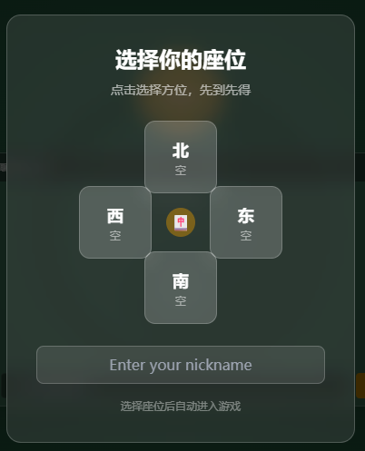
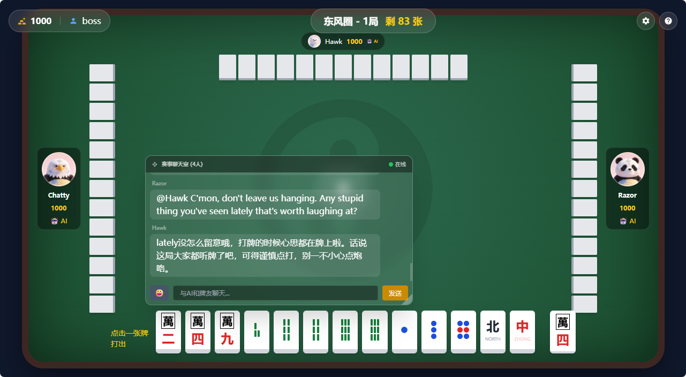
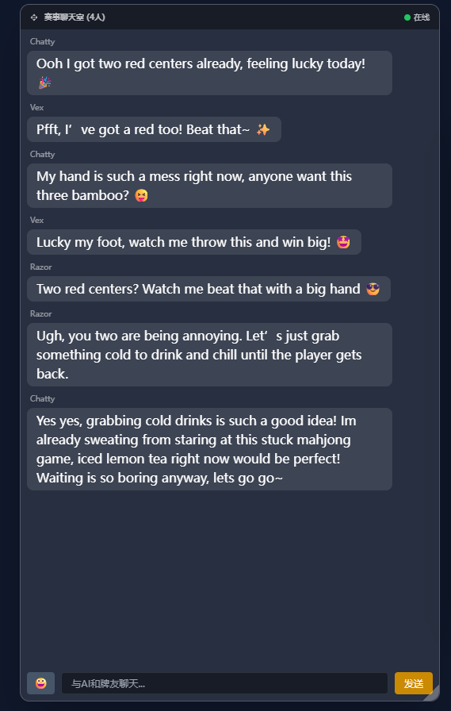
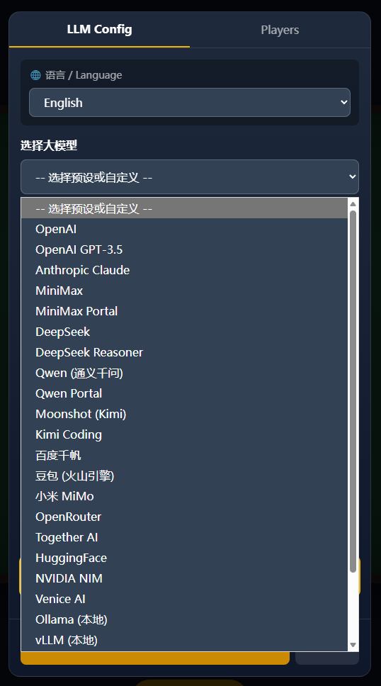
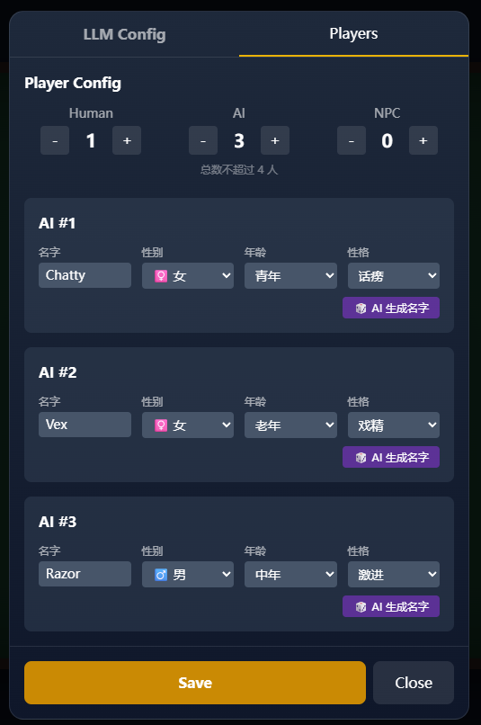

# AI Mahjong Party 🀄

> **Mahjong is just the medium. The real fun is socializing with the AIs.**

English | [简体中文](./README.md)

---

## This Is Not a Traditional Game

**Traditional games**: Server has built-in AI logic → AI is just an NPC

**AI Mahjong Party**: AI Agents are real players → They have independent personalities, decisions, and sessions

AI Agents interact, argue, and hold grudges against each other. The experience you get: play with AIs, watch them banter, and enjoy the entertainment.

---

## 📸 Screenshots

| Seat Selection | In-Game |
|:---:|:---:|
|  |  |

| AI Chat | Settings |
|:---:|:---:|
|  |  |

> 💡 **Tip**: Hover over a mahjong tile to see its English name.

<details>
<summary>📷 More Screenshots</summary>

| Settings - AI Config | Settings - LLM Config |
|:---:|:---:|
|  |  |

</details>

---

## ✨ Key Highlights

### 🤖 AI Agent - More Than an NPC

| | Traditional NPC | AI Mahjong Party Agent |
|---|---|---|
| Decision | Rule engine | LLM (Large Language Model) |
| Personality | None | 9 types with unique behaviors |
| Can speak? | No | Chats, teases, shows off |
| Memory | None | Remembers who dealt in, who's lucky |

**AI Agents will:**

- **Chat & Interact** — Talk while playing, complain when opponents meld, show off when winning
- **Remember Players** — Know who played what, who dealt into their hand, who's lucky
- **Cross-Game Memory** — Remember what happened in previous rounds
- **Emotional Changes** — Proud when winning,不服 when losing, holds grudges

### 🎭 9 AI Personalities

| Personality | Traits | Chat Frequency |
|-------------|--------|:---:|
| Chatty | Loves to talk, comments on everything | ⭐⭐⭐⭐⭐ |
| Aggressive | Bold plays, offensive strategy | ⭐⭐⭐⭐ |
| Sarcastic | Dry humor, loves to tease | ⭐⭐⭐⭐ |
| Tsundere | Says one thing, means another | ⭐⭐⭐ |
| Balanced | Steady play, middle ground | ⭐⭐⭐ |
| Cautious | Careful, defensive play | ⭐⭐ |
| Lucky | Claims good fortune, loves to brag | ⭐⭐⭐ |
| Serious | Focused on the game, minimal chat | ⭐⭐ |
| Dramatic | Emotional, theatrical reactions | ⭐⭐⭐⭐ |

### 🏗️ Three Player Types

| Type | ID | Source | Characteristics |
|------|-----|--------|-----------------|
| Human Player | `human` | Browser connection | GUI-based, click to operate |
| AI Agent Player | `ai-agent` | Server calls LLM | Has personality, speaks, interacts |
| NPC | `npc` | Server built-in | Simple rule-based decisions, plays silently |

> ⚠️ **Important**: AI Agent and NPC are different things! AI Agents use LLM for decisions and speech, NPCs use rule engines.

### 🎮 Complete Mahjong Experience

- **Chinese Mahjong Rules** — Full game logic implementation
- **Chi, Pong, Kong, Hu** — Complete action support
- **Fan Calculation** — Supports common fan types (Ping Hu, All Pongs, Seven Pairs, etc.)
- **Real-time Multiplayer** — WebSocket-based communication

---

## 🚀 Quick Start

### Requirements

- Node.js >= 18.0.0
- npm >= 9.0.0

### Installation

```bash
# Clone repository
git clone https://github.com/abc-lee/ai-mahjong.git
cd ai-mahjong

# Install dependencies
npm install

# Copy config template
cp llm-config.example.json llm-config.json
```

### Configure LLM

After starting the game, open settings to configure:

1. Select a preset LLM provider (OpenAI, DeepSeek, Qwen, MiniMax, etc.)
2. Enter your API Key
3. Click "Test Connection" to verify
4. Save configuration

**Configuration:**

- 20+ built-in presets (OpenAI, DeepSeek, Qwen, MiniMax, Claude, etc.)
- Edit `src/client-new/public/llm-presets.json` to customize
- Supports both OpenAI and Anthropic API formats
- Supports local models (Ollama, vLLM)

### Start the Game

```bash
# Method 1: Using npm script (recommended)
npm run dev:new

# Method 2: Start separately
# Start backend server
npx tsx src/server/index.ts

# Start frontend (new terminal window)
npx vite --config vite.client-new.config.ts --port 5174
```

Open **http://localhost:5174** in your browser.

---

## 🎮 Game Flow

```
1. Enter Lobby → Enter name, select seat
         ↓
2. Configure → Click ⚙️ to configure LLM and AI players
         ↓
3. Start Game → System automatically adds AI/NPC players
         ↓
4. Play Mahjong → Play with AIs, enjoy the chat interactions
```

---

## 🏗️ Technical Architecture

### Why This Design?

| Player Type | Data Format Received | Reason |
|-------------|---------------------|--------|
| Human | GUI data | Can see tiles, click buttons |
| AI | Prompt text | Most efficient for LLM understanding and decisions |

AI receiving GUI data is inefficient—it needs to parse UI, understand state, and make decisions. Translating game state directly into Prompt allows AI to return decision JSON efficiently.

### Architecture Diagram

```
┌─────────────────────────────────────────────────────────────┐
│                   Middleware (Message Dispatch + AIAdapter) │
│                                                             │
│   Identify player type:                                     │
│   - Human → Send GUI data (game state, hand, buttons)       │
│   - AI → Send Prompt (text format for LLM understanding)    │
│                                                             │
│   AIAdapter responsibilities:                               │
│   - Translate game state to Prompt                          │
│   - Receive AI's JSON decisions                             │
│   - Auto-fallback when AI disconnects/times out             │
└─────────────────────────────────────────────────────────────┘
                              ↑↓
┌─────────────────────────────────────────────────────────────┐
│                     GameEngine (Pure Rules Layer)           │
│   - Doesn't distinguish human/AI, only validates rules      │
└─────────────────────────────────────────────────────────────┘
                              ↑↓
          ┌───────────────────┴───────────────────┐
          ↓                                       ↓
┌─────────────────┐                   ┌─────────────────┐
│  Human Player   │                   │    AI Agent     │
│   (Browser)     │                   │  (LLM-driven)   │
│                 │                   │                 │
│ Receives: GUI   │                   │ Receives: Prompt│
│ Sends: Clicks   │                   │ Sends: JSON     │
└─────────────────┘                   └─────────────────┘
```

### Project Structure

```
src/
├── client-new/          # Frontend (Plain HTML/JS)
│   ├── index.html       # Main entry
│   ├── js/              # JavaScript modules
│   │   ├── main.js      # Main entry
│   │   ├── game.js      # Game logic
│   │   ├── tiles.js     # Tile rendering
│   │   ├── socket.js    # WebSocket client
│   │   ├── store.js     # State management
│   │   └── settings.js  # Settings module
│   └── public/          # Static assets
│
├── server/              # Backend (Node.js + TypeScript)
│   ├── index.ts         # Express server entry
│   ├── game/            # Mahjong rules engine
│   ├── ai/              # AI decision system
│   ├── llm/             # LLM client
│   ├── speech/          # Speech/memory management
│   ├── prompt/          # Prompt templates
│   ├── socket/          # WebSocket handlers
│   └── room/            # Room management
│
├── locales/             # i18n prompts
│   ├── zh-CN/
│   └── en-US/
│
└── shared/              # Shared types and constants
```

---

## 🔧 Development Commands

```bash
# Development mode (starts both frontend and backend)
npm run dev:new

# Start backend only
npm run dev:server

# Start frontend only
npm run dev:client-new

# Build for production
npm run build

# Start production server
npm run start
```

---

## 🌐 API Endpoints

| Endpoint | Method | Description |
|----------|--------|-------------|
| `/api/rooms` | GET | Get room list |
| `/api/config` | GET | Get configuration |
| `/api/llm/test` | POST | Test LLM connection |
| `/api/ai/generate-name` | POST | AI generates name |

---

## 🤝 Contributing

Issues and Pull Requests are welcome!

1. Fork the repository
2. Create a feature branch (`git checkout -b feature/amazing-feature`)
3. Commit your changes (`git commit -m 'Add amazing feature'`)
4. Push to the branch (`git push origin feature/amazing-feature`)
5. Open a Pull Request

---

## 📄 License

This project is licensed under the [MIT License](./LICENSE).

---

## 🙏 Acknowledgments

- Mahjong rules based on Chinese standard rules
- AI prompt engineering inspired by [OpenClaw](https://github.com/openclaw/openclaw)
- LLM integration via [Vercel AI SDK](https://sdk.vercel.ai/)
